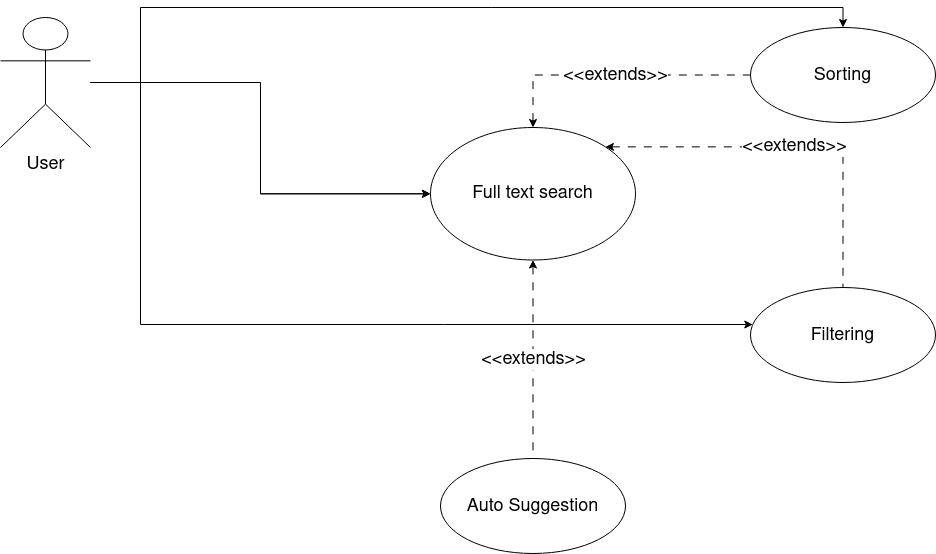

# Search

The search in this scenario is a full text search (fts). The user can trigger a search, possibly select a **suggested
search term** and **sort** or **filter** the search results in one of the following steps.



The auto-suggestion use case makes it necessary to send a first request to the Elasticsearch server and let it offer a
list of suggested search terms back again which will lead to a non-empty search result set.

If the user filters search results the search will be done again with an additional post filter request or an additional
must criteria added to the fulltext search.

The sorting allows to re-arrange the search result list.

## Search context

Whenever your search process should be started you have to set some circumstances around it.

Imagine the language user want to search for or the search term itself. You want to add suggestion to your request that
the user can select more powerful search terms. It could be that you want to pre-evaluate filter criteria and values
which would lead to a successful filtered search result.

This is what we call the **search context**.

Whenever you need to search something, we recommend the following way, which allows you to perform your search step-by-step according to the open-closed principle.

Imagine we have a `SearchController` with a `searchAction` method:

```php
    public function searchAction(Request $request): Response
    {
        // handle your request, check forms, do whatever is necessary
        
        // 1.Step: Prepare your search by given parameters
        // Typically you have to set request (for number of items and page offset), 
        // client, index name and searchterm
        $searchContext = (new SearchContext())
            ->setRequest($request)
            ->setSearchTerm('your_search_term')
            ->setClient($this->client)
            ->setIndexName('product');

        // 2.Step: Do the search
        $this->search->search($searchContext);

        // 3.Step: Use searchContext to render your results 
         return $this->render(
            'Search/search_results.html',
            [
                'items' => $searchContext->getSearchResults(),
                'totalCount' => $searchContext->getTotalCount(),
                // et al.
            ],
        );
        
    }
```

## The Search

The core component for the Search is the following class:

```php
namespace Neusta\ElasticSearchBundle\Search\Handler;

use Neusta\ElasticSearchBundle\Search\SearchContext;

class Search
{
    public function __construct(
        private array $preSearchHandlers,
        private array $searchHandlers,
        private array $postSearchHandlers,
    ) {
    }

    public function search(SearchContext $searchContext)
    {
        foreach ($this->preSearchHandlers as $preSearchHandler) {
            $preSearchHandler->handlePreSearch($searchContext);
        }
        foreach ($this->searchHandlers as $searchHandler) {
            $searchHandler->handleSearch($searchContext);
        }
        foreach ($this->postSearchHandlers as $postSearchHandler) {
            $postSearchHandler->handlePostSearch($searchContext);
        }
    }
}
```

As you can see, the pre-search handlers are called first, then the search handlers, and finally the post-search handlers.

So every single step of preparation, search or post aggregation can be done by a dedicated handler class.

### Trichotomy

Why did we do this separation into three parts? Couldn't it be done by a list of handlers?

Short answer: Yes, it could.

One advantage is a better readability. Which handler is doing things before the search will be done? Which handler is
using the search results after search? And which handler is searching?

The configuration of the Search shows you what exactly will be done:

```yaml
# -- Search --
Neusta\Pimcore\ElasticBundle\Search\Handler\Search:
    arguments:
        $preSearchHandlers:
            - '@My\SearchQuery'
            - '@My\SpecialPriceFilter'
            - '@My\OtherFilter'
        $searchHandlers:
            - '@My\Search'
        $postSearchHandlers:
            - '@My\SearchResults'
            - '@My\PriceAggregator'
            - '@My\OtherAggregator'
```

It's a pipeline of handlers that use the search context as a blackboard for sharing data and specifying results.

### Some default handlers

---

#### SearchQueryHandler

The SearchQueryHandler creates a simple search term query which is paginated und put it into search context.

Therefore, you have to prepare the search context:

```php
$searchContext->setValue(SearchContext::CONTEXT_KEY_PAGE, 1);
$searchContext->setValue(SearchContext::CONTEXT_KEY_ITEMS_PER_PAGE, 20);
$searchContext->setSearchTerm('what-i-am-searching-for');
```

##### Pre condition

* search context value `SearchContext::CONTEXT_KEY_PAGE` has been set
* search context value `SearchContext::CONTEXT_KEY_ITEMS_PER_PAGE` has been set

##### Post condition

* search context has search query

---

#### AddMultiselectFilter

The AddMultiselectFilter handler sets a filter to the query or uses the given filter (including criterias if activated).

##### Declaration

For the declaration you need to know the index field which should be filtered and define a terms name:

```yaml
services:
    my.filter:
        class: Neusta\Pimcore\ElasticBundle\Search\Handler\Default\PreSearch\AddMultiselectFilter
        arguments:
            $fieldName: 'my_index_fieldname'
            $filterTermsName: 'my_terms_name'
```

##### Pre condition

For an active filter:

* `Filter` object has been defined in `$searchContext->getFilterByKey('my_terms_name')`
* This filter is active
* The filter contains an array of string values as criterias

##### Post condition

* Filter will be added to the search query as must post filter.

---

#### AddRangeFilter

The AddRangeFilter handler sets a filter to the query or uses the given filter (including criterias if activated).

##### Declaration

For the declaration you need to know the index field which should be filtered and define a terms name:

```yaml
services:

    my.special.field.formatter:
        class: Formatter\MySpecialFormatter # <-- use your implementation here

    my.filter:
        class: Neusta\Pimcore\ElasticBundle\Search\Handler\Default\PreSearch\AddRangeFilter
        arguments:
            $fieldName: 'my_index_fieldname'
            $filterTermsName: 'my_terms_name'
            $formatter: '@my.special.field.formatter'
```

##### Pre condition

For an active filter:

* `Filter` object has been defined in ` $searchContext->getFilterByKey('my_terms_name')`
* This filter is active
* The filter contains minimum and maximum value for (closed) range to filter

##### Post condition

* Filter will be added to the search query as must post filter.

## Queries

So, therefore you have to create queries which are instances of `Elastica\Query`.

A query defines what you want to look for and other parameters (e.g. pagination, limits, ...).

A simple example how you can create and search with our Elasticsearch server is done here:

```php
// use our query
$queryFactory = new Neusta\Pimcore\ElasticBundle\Search\Factory\QueryFactory();

// create a search query
$searchQuery = $queryFactory->createSearchQuery();

// add some 'conditions' by adding additional queries (e.g. 'Query\QueryString')
$queryFactory->addMustQuery($searchQuery, new Query\QueryString('search word'));
$queryFactory->addMustNotQuery($searchQuery, new Query\QueryString('forbidden word'));

// let the server do the rest for you
$resultSet = $client->getIndex('nameOrAliasOfYourIndex')->search($searchQuery);
```

The searchQuery is of type `Elastica\Query\BoolQuery` to allow to add must and must-not criterias by combining
additional queries.

### Aggregations

Sometimes you need some information about the searchable variants. Imagine, you want to look for different products
like shirts. It could be helpful for you to know how many different sizes the search resultset will contain.

In Elasticsearch we call that Aggregations.

You have to predefine that you are interested in a certain aggreation and after search you can see the result.

#### Preparation

To prepare your search, you should have aggregation definitions:

```php
// use the query factory from above and
// add an aggregation with a given name (e.g. 'possible_sizes')
// and an associated field (e.g. 'size')
$this->queryFactory->addAggregation($searchQuery, 'possible_sizes', 'size');
```

That's it.

#### Execution

For the evaluation of the aggregations we have introduced a new PreSearchHandler
called `Neusta\Pimcore\ElasticBundle\Search\Handler\Default\PreSearch\AddAggregations`
with a symbolic Symfony name `search.aggregations`:

Just add it to your search declaration:

```yaml
  Neusta\Pimcore\ElasticBundle\Search\Search:
      arguments:
          $preSearchHandlers:
              ...
              - '@search.aggregations'
              ...
          $searchHandlers:
              ...
          $postSearchHandlers:
              ...
```

#### Evaluation

The AggregationsHandler is collecting all necessary aggregations at once. After that each aggregation has to collected
by its search handler:

* `CollectMultiselectAggregationValues`
* `CollectRangeAggregationValues`

Both handlers will be configured by the `filterTermsName` (the key where the aggregation has been placed in the search
context) and a formatter object which offers the possibility to format the given values in a more readable version.

After that an `Aggregate` object has been added to the list of aggregations in your search context.

This object of type `Neusta\Pimcore\ElasticBundle\Search\Model\Aggregate` contains several
`Neusta\Pimcore\ElasticBundle\Search\Model\AggregateItem` objects which have two attributes:

* value (string representation of a possible value; e.g. S,M,L,XL,XXL,...)
* label (formatted string representation of a possible value; e.g. S,M,L,XL,XXL,...)
* count (number of objects with the same value)

Done.
